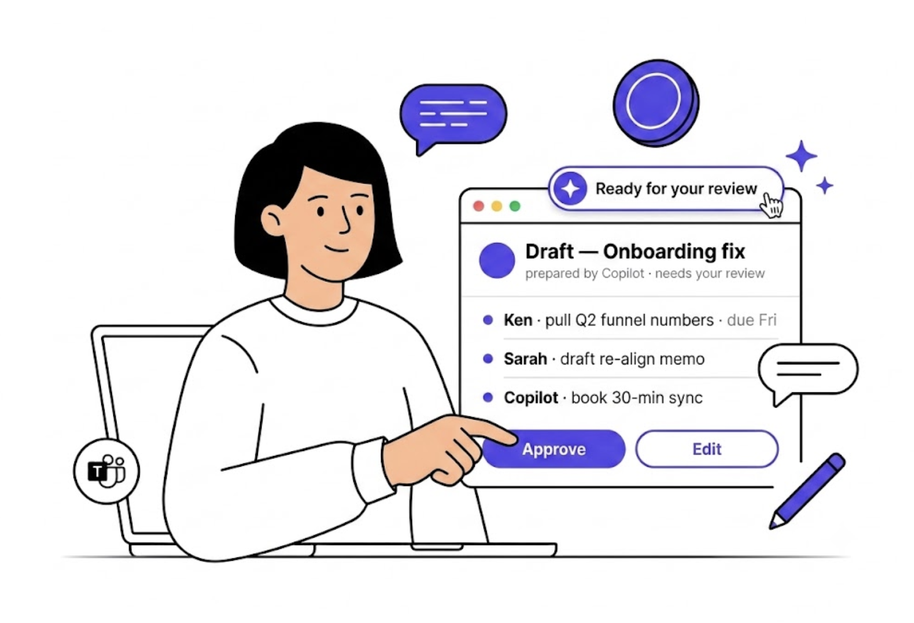
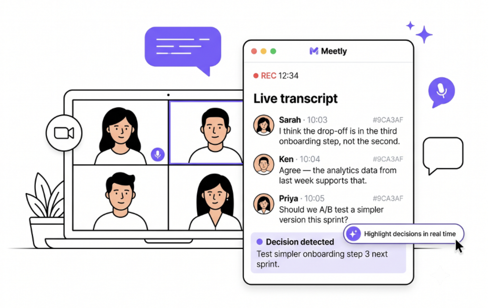
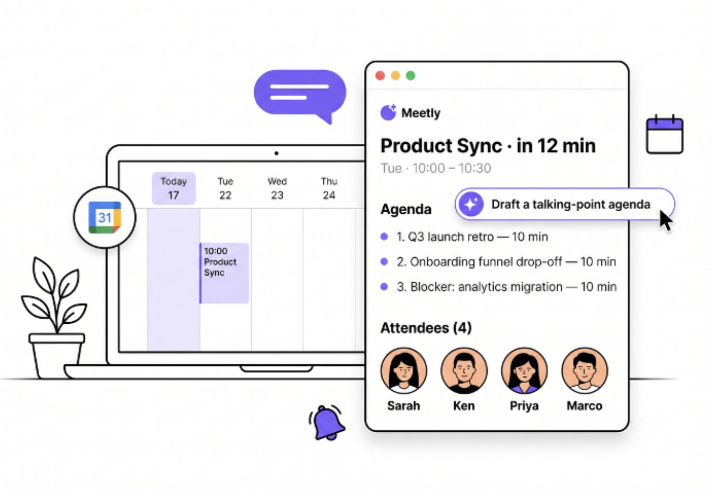

<div align="center">

[中文](./README.zh.md) · **English**

# 🎨 SaaS Illustration

---

**One-brand-color SaaS product hero illustrations — real UI card × line-art scene × single accent color.**

[](./LICENSE)
[]()
[](./examples)
[](https://github.com/yanliudesign/saas-illustration/stargazers)

[](https://claude.ai/code)
[]()
[]()
[]()
[]()

</div>

A design-taste skill that turns any SaaS product brief into a **clean, professional hero illustration** — the kind that lives on a landing page, blog header, or feature section. Signature move: a **real product UI card floating in the foreground**, a **line-art scene behind it**, and **one brand color** doing all the accent work.

Not a coloring book. Not a concept illustration. Not a hand-drawn zine. This is the disciplined SaaS look — Linear · Superhuman · Tactiq · Notion — but generated from a prompt.

**Also works for adjacent digital-product scenarios** — technical talk covers, portfolio featured-project cards, workshop / course landing pages, research paper announcement graphics, product-launch email headers, internal all-hands / roadmap slides. Any moment where you need *one artifact + one brand color + one clean scene*, this skill applies.

<p align="center">
  
  
  
</p>

## What's inside

| File | Purpose |
|---|---|
| [`SKILL.md`](./SKILL.md) | Skill entry point — Claude reads this to decide when / how to trigger |
| [`references/style-dna.md`](./references/style-dna.md) | Palette, line weight, materials, hard rules |
| [`references/composition-patterns.md`](./references/composition-patterns.md) | 5 primary compositions + how to place decorations |
| [`references/prompt-template.md`](./references/prompt-template.md) | The single-image prompt template (variables + scene / decoration libraries) |
| [`references/qa-checklist.md`](./references/qa-checklist.md) | Post-generation checklist + local-edit prompts for common failures |
| [`examples/`](./examples/) | 3 real generations with copy-paste prompts |

## Three rules the skill lives by

1. **One accent color only.** No rainbows. Every stray blue / green / red is a bug. Purple is just the default — you can swap it for any brand HEX.
2. **The UI card must be a real product.** Show *this* product's most-core screen — real names, real numbers, real copy. No lorem ipsum, no generic chat window.
3. **Layering, not shadows.** The card floats because it overlaps the scene, not because of a drop shadow. No glow, no gradient, no 3D, no isometric.

## Install

Drop into your Claude Code skills folder:

```bash
git clone https://github.com/yanliudesign/saas-illustration.git \
  ~/.claude/skills/saas-illustration
```

Restart Claude Code. Trigger phrases live at the top of [`SKILL.md`](./SKILL.md).

## Trigger phrases

| You say | It runs |
|---|---|
| *"Landing page hero illustration for my SaaS"* | this skill |
| *"Feature section illustration"* / *"blog header illustration"* | this skill |
| *"Talk cover / portfolio hero / workshop landing illustration"* | this skill |
| *"Give me a Linear / Superhuman style illustration"* | this skill |
| *"Purple illustration"* / *"one-brand-color illustration"* (legacy alias) | this skill |

## Good for

- **All SaaS marketing surfaces** — landing hero, feature sections, pricing-page graphics, blog headers, Twitter announcement cards
- **B2B / enterprise product launches** — launch-email headers, changelog covers, PLG-style feature spotlights
- **Trust-building business content** — investor deck covers, pitch decks, fundraise-page hero, whitepaper covers
- **Developer / technical content** — conference talk covers, dev blog headers, API doc headers, SDK release notes
- **AI / data / research communication** — research paper covers, model-card headers, AI product launch graphics, evals dashboards
- **Education / workshops / courses** — course landing pages, bootcamp signup pages, workshop banners, Notion learning modules
- **Portfolio / case studies** — featured project cards, case study headers, personal site hero for designers / PMs / engineers

## Not for

- **Entertainment / streaming / game promo art** — needs mood and drama; a floating UI card would look off
- **Consumer goods / fashion / beauty / F&B** — needs real product photography and emotional warmth, not vector line art
- **Fiction / children's book / graphic novel covers** — needs narrative illustration, not a marketing screen
- **Concert / exhibition / event posters** — that's typographic design, not product illustration
- **Whimsical hand-drawn illustrations** for essays, zines, personal blogs (opposite aesthetic)
- **Real-photo social covers** (Xiaohongshu / Douyin viral-style covers with faces)
- **Editorial magazine / newspaper illustrations** — needs artistry and narrative, not clarity

## Delivery format

One turn gives you:

1. **Composition strategy** (2–4 lines: why this composition, what the UI card shows, what decorations)
2. **A ready-to-paste English prompt** in a code block
3. **Optional variants** (max 2: different composition / camera / decoration set)
4. **Local-edit snippets** ("if X drifts, append this")

No essay on style theory, no shot-list padding. This skill is optimized for shipping *one image*.

## License

MIT — see [LICENSE](./LICENSE).
