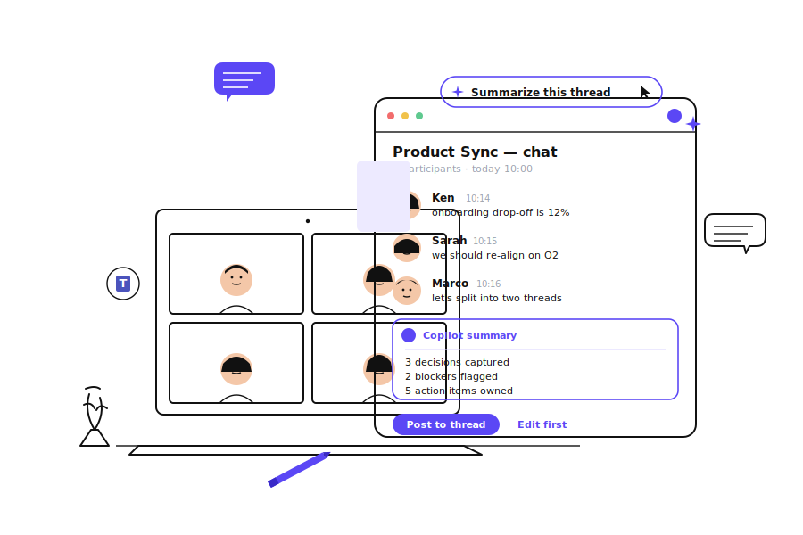
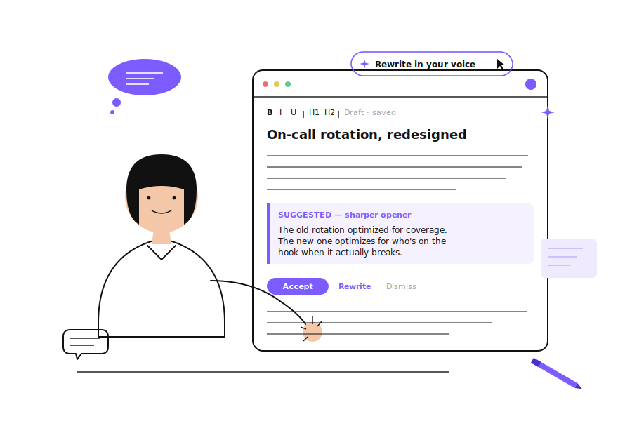
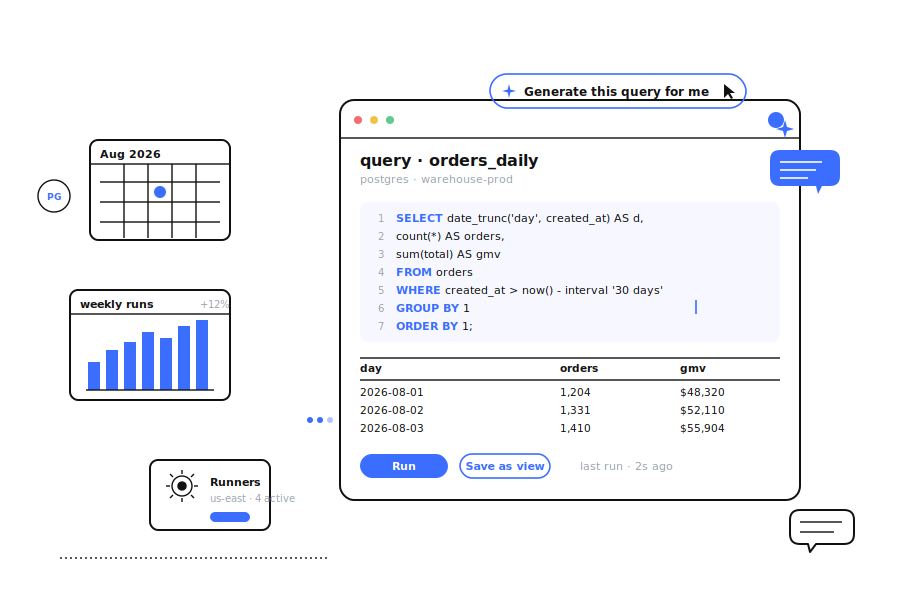

# purple-illustration

**紫色（或任意单品牌强调色）SaaS 产品英雄插画风格 · Claude Code Skill**

为 SaaS / AI 产品的营销场景生成一张干净、专业、可信、能一眼看懂产品在做什么的英雄插画。不是解释性配图，不是漫画，不是手绘草图——是一张**能直接放在官网首屏或 blog 顶图**的插画。

**标志性动作**：真产品 UI 卡片漂浮在前景 + 线稿场景在后景 + 少量品牌色装饰散落周围。

---

## What's inside

| 文件 | 作用 |
|---|---|
| [`SKILL.md`](./SKILL.md) | Skill 主入口，Claude 读它来决定何时/如何触发 |
| [`references/style-dna.md`](./references/style-dna.md) | 调色板、线条、材质、禁忌 |
| [`references/composition-patterns.md`](./references/composition-patterns.md) | 5 种主构图套路 + 装饰物摆放法 |
| [`references/prompt-template.md`](./references/prompt-template.md) | 单张生图提示词模板（含变量） |
| [`references/qa-checklist.md`](./references/qa-checklist.md) | 生成后检查和迭代规则 |
| [`examples/`](./examples/) | 3 个跨构图 + 跨品牌色的示例（SVG 目标图 + 可复制 prompt） |

## Examples

|  | Composition | Product | Accent |
|---|---|---|---|
| [01](./examples/01-teams-copilot.md) | A · laptop + UI card | Group Copilot for Teams | `#5B47F5` |
| [02](./examples/02-writing-assistant.md) | C · single person + UI card | AI writing assistant | `#7C5CFF` |
| [03](./examples/03-devtool-workspace.md) | E · abstract workspace | Developer / data tool | `#3B6DFF` |

<p align="left">
  
  
  
</p>

## Install

放到 Claude Code 的 skills 目录（macOS）：

```bash
git clone https://github.com/yanliudesign/purple-illustration.git \
  ~/.claude/skills/purple-illustration
```

然后重启 Claude Code。触发关键词见 `SKILL.md` 顶部。

## 输出示例的口径

一次交付：

1. 配图策略（2–4 行）
2. 可复制的完整英文提示词
3. 可选的备用变体（最多 2 个）
4. 迭代提示片段

## 与其他 skill 的边界

- 不与 `ian-xiaohei-illustrations` 混用（那是白纸手绘怪诞正文配图）
- 不与 `atutun-xhs-cover` / `cover-design-open` 混用（那些是小红书 / 公众号封面）
- 官网首图、feature section、SaaS blog 顶图 → **本 skill**
